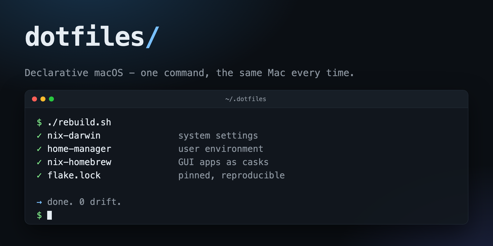

# dotfiles



Declarative macOS setup: [nix-darwin](https://github.com/nix-darwin/nix-darwin) for
system settings, [home-manager](https://github.com/nix-community/home-manager) for
the user environment, and [nix-homebrew](https://github.com/zhaofengli/nix-homebrew)
for GUI apps that only ship as casks.

Everything is pinned by `flake.lock`, so a rebuild produces the same machine every time.

## First time on a new Mac

```sh
git clone <this repo> ~/.dotfiles
cd ~/.dotfiles
./bootstrap.sh
```

`bootstrap.sh` installs the Xcode command line tools and Determinate Nix, points
`~/.dotfiles` at this checkout, offers to rewrite the username in `flake.nix` to
match whoever is running it, and performs the first `darwin-rebuild switch`.

It is safe to re-run: every step skips itself if it is already done.

## Day to day

```sh
./rebuild.sh                 # apply your changes
./rebuild.sh --show-trace    # same, with a full error trace when eval fails
./rebuild.sh --dry-run       # build and report what would change, without activating
```

**Commit or at least `git add` new files before rebuilding.** Flakes only see
git-tracked files, so a new module that is still untracked is silently invisible.
`rebuild.sh` checks for this and stops rather than building something stale.

Roll back to the previous generation:

```sh
sudo darwin-rebuild --list-generations
sudo darwin-rebuild --rollback
```

Update the pinned inputs (nixpkgs, home-manager, ...):

```sh
nix flake update && ./rebuild.sh
```

## Layout

| Path | What lives there |
| --- | --- |
| `flake.nix` | Inputs, the `user` name, `bulkStore`, and the `mac` host definition |
| `configuration.nix` | System scope: macOS defaults, Dock, Finder, Homebrew casks |
| `home.nix` | User scope: packages, zsh, starship, git, neovim, direnv |
| `home/` | Real config files, symlinked into `~` (see below) |

## Big SDKs on an external drive

`bulkStore` in `flake.nix` is the one knob for machines whose internal disk cannot
hold the Android toolchain. Set to a mounted volume it redirects the Android
Studio app bundle, the SDK, AVD images and the Gradle cache there. Set to `null`
everything reverts to the stock macOS locations, which is what you want on a Mac
with room to spare:

```nix
bulkStore = "/Volumes/SSD";   # or null
```

The paths are derived once in `flake.nix` as `android`, then consumed twice,
because macOS has two separate environments:

- `home.nix` puts them in `home.sessionVariables`, which reaches anything started
  from a terminal.
- `configuration.nix` puts them in a `launchd.user.agents.android-env` agent,
  which reaches anything started from the Dock or Spotlight. Without this, an
  emulator created in Android Studio's Device Manager would land in
  `~/.android/avd` on the internal drive. The agent runs at login and on
  rebuild; either way only apps launched afterwards see the change.
  `launchctl getenv ANDROID_HOME` is how you check it took.

Two things it still cannot do for you:

- **Android Studio's first-run wizard stores its own SDK path.** It does not read
  `ANDROID_HOME`, it offers `<volume>/Library/Android/sdk` for whichever volume
  you point it at, which is why `sdk` in `flake.nix` is spelled that way rather
  than something tidier. Confirm the location the wizard offers matches
  `echo $ANDROID_HOME` before accepting it. The two disagreeing is quiet: Studio
  keeps working off its own copy while `adb` and the other `PATH` entries from
  `home.nix` point at a directory that does not exist, and the next CLI
  `sdkmanager` run downloads a second ~10GB SDK beside the first. Studio's answer
  lives in `~/Library/Application Support/Google/AndroidStudio*/options/android.sdk.path.xml`
  and is changed under Settings > Languages & Frameworks > Android SDK.
- **The volume has to be mounted.** With the drive detached, `adb`, Gradle and the
  emulator fail, since every path above points into it.

Studio's own config, logs and project indexes stay on the internal drive under
`~/Library/{Application Support,Caches,Logs}/Google`. That is deliberate. It is a
few hundred MB of index cache that wants to be on fast local disk, not the tens of
GB this section exists to move.

Xcode is not managed here at all. It came from the App Store and is already on the
SSD; `xcode-select -p` is the source of truth for where.

## Editing config files

`home.nix` links `home/` into your home directory with `mkOutOfStoreSymlink`, so
`~/.config/nvim/init.lua` and friends point straight back at this repo:

- Editing a file **under `home/`** takes effect immediately. No rebuild.
- Adding a **new** symlink mapping means a new `home.file."...".source` line in
  `home.nix`, which does need `./rebuild.sh`.

`~/.claude/settings.json` works the same way, so settings you change from inside
Claude Code land in this repo as a normal diff.

## Gotchas

- `homebrew.onActivation.cleanup = "uninstall"` in `configuration.nix` removes any
  cask that is not listed there. Install GUI apps by adding them to `casks`, not
  with `brew install`.
- `system.stateVersion` and `home.stateVersion` record which release this machine
  was first set up under. They are not version numbers to keep current. Leave them
  alone.
- The host is named `mac` in `flake.nix`. Renaming it means updating `rebuild.sh`
  and `bootstrap.sh` too.
